# HR Analytics: Employee Attrition & Performance

## 🔍 Project Overview
This project uses the **HR Analytics: Employee Attrition & Performance** dataset from Kaggle to explore, model, and report on factors that lead to employee attrition, understand employee performance patterns, and provide actionable insights for workforce retention and HR decision-making.
-- ** (https://www.kaggle.com/datasets/mahmoudemadabdallah/hr-analytics-employee-attrition-and-performance)
---

## 📚 Dataset Details
- **Dataset name:** IBM HR Analytics Employee Attrition & Performance (Kaggle)  
- **Number of records:** ~1,470 employees  
- **Number of features:** 35 columns  
- **Target variable:** `Attrition` (“Yes” / “No”)  

---

## 🔑 Features / Variables (Selected)

| Category                   | Sample features                                                                 |
|----------------------------|---------------------------------------------------------------------------------|
| **Demographic**            | Age, Gender, MaritalStatus, DistanceFromHome                                   |
| **Job / Role**             | Department, JobRole, BusinessTravel                                            |
| **Satisfaction / Work Environment** | EnvironmentSatisfaction, JobSatisfaction, WorkLifeBalance, RelationshipSatisfaction |
| **Performance / Career**   | PerformanceRating, YearsSinceLastPromotion, YearsWithCurrManager               |
| **Compensation / Income**  | MonthlyIncome, PercentSalaryHike                                               |

> **Note:** Some features like `EmployeeCount`, `StandardHours`, `EmployeeNumber`, or `Over18` are either constant or not useful for modeling and can be dropped.

---

## 🔎 Exploratory Data Analysis (EDA)

### Attrition Overview
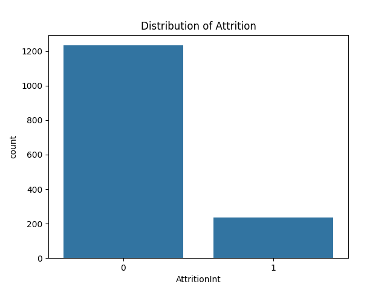  
*Overall attrition rate across the company.*

### Attrition by Demographics
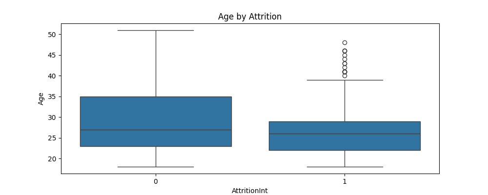  
*Age distribution vs attrition.*  

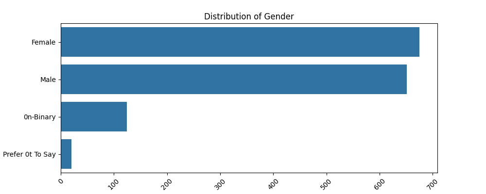  
*Gender distribution of employees.*  

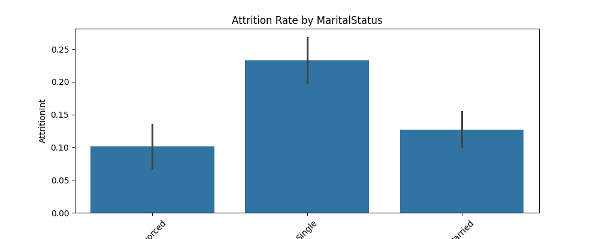  
*Attrition by marital status.*

### Attrition by Job & Work Factors
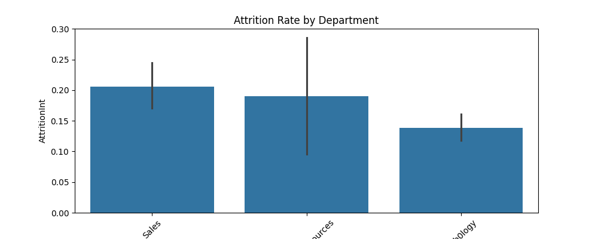  
*Attrition rate across departments.*

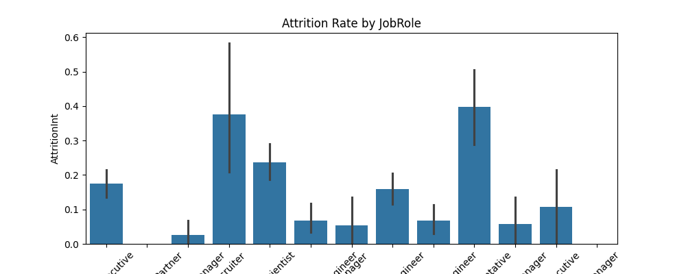  
*Attrition rate by job role.*

  
*Employees who work overtime are more likely to attrite.*

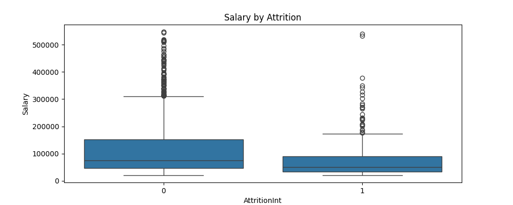  
*Salary distribution among attrited vs retained employees.*

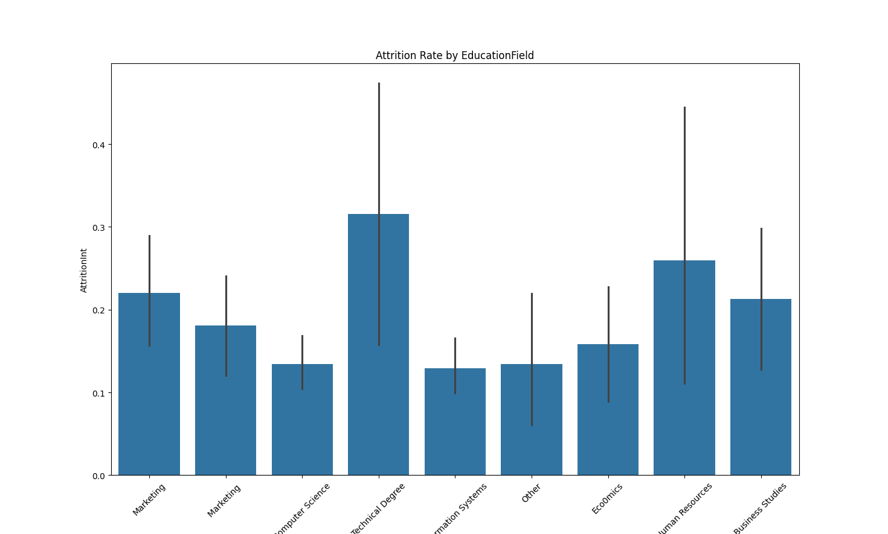  
*Attrition rate by education level.*

### Additional Distributions
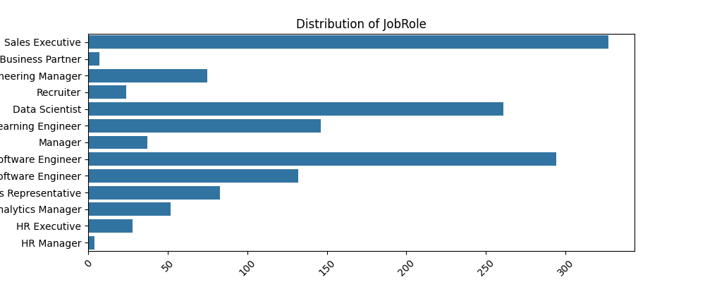  
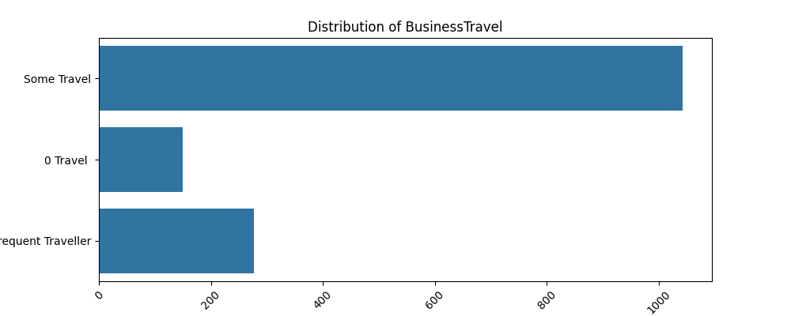  
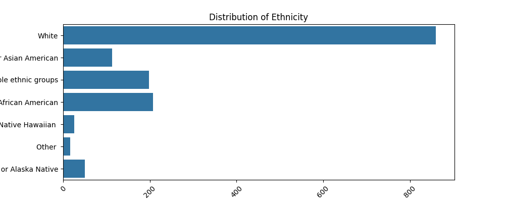  
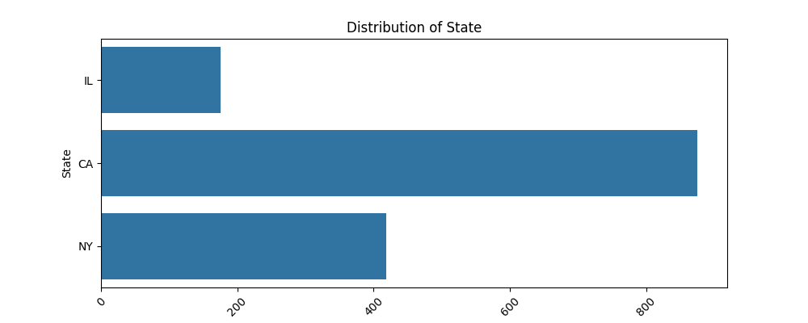  

### Correlation Analysis
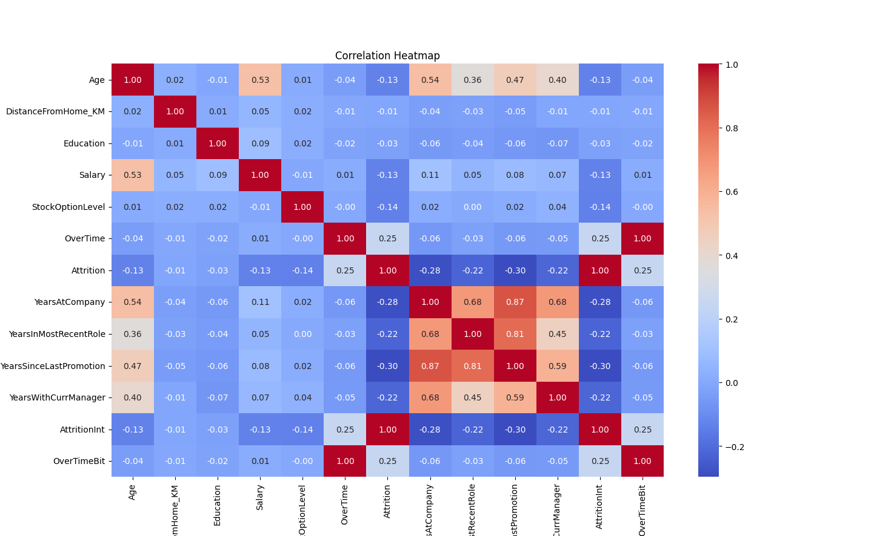  
*Correlation between numerical features.*

---

## 🤖 Modeling Approach (in-progress)
- **Data cleaning & preprocessing**  
  ‣ Drop irrelevant/constant features (`EmployeeNumber`, `StandardHours`, `Over18`)  
  ‣ Encode categorical variables (one-hot, label encoding)  
  ‣ Scale numeric features if needed  

- **Feature selection**  
  ‣ Correlation analysis and statistical tests (ANOVA, Chi-square)  

- **Modeling / Algorithms**  
  ‣ Logistic Regression  
  ‣ Random Forest  
  ‣ Gradient Boosting (XGBoost / LightGBM)  
  ‣ Optional: KNN, SVM for comparison  

- **Evaluation Metrics**  
  ‣ Accuracy, Precision, Recall, F1-score  
  ‣ ROC-AUC  
  ‣ Confusion matrix  
  ‣ Cross-validation to avoid overfitting  

- **Model Interpretability**  
  ‣ Feature importance, SHAP values, etc.

---

## 📈 Sample Insights
- Employees who work **OverTime** are significantly more likely to attrite.  
- **Job, environment, and relationship satisfaction** show strong negative correlation with attrition.  
- **YearsSinceLastPromotion** & **YearsWithCurrManager** are important predictors.  

---

## ⚙️ How to Run
1. Clone the repository  
git clone https://github.com/shreya-328/HR-Analysis.git
cd HR-Analysis

2. Install dependencies

pip install -r requirements.txt

3. Run notebooks / scripts

jupyter notebook notebooks/EDA.ipynb
python scripts/data_cleaning.py
python scripts/modeling.py

4. View outputs & visualizations in output/output/ folder

